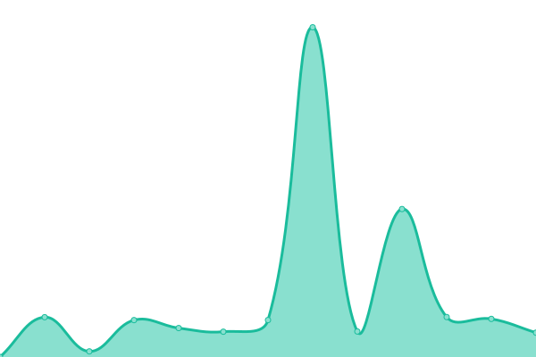

# [📈 Live Status](https://status.felixmedia.xyz): <!--live status--> **🟩 All systems operational**

This repository contains the open-source uptime monitor and status page for [Upptime](https://upptime.js.org), powered by [Upptime](https://github.com/upptime/upptime).

With [Upptime](https://upptime.js.org), you can get your own unlimited and free uptime monitor and status page, powered entirely by a GitHub repository. We use [Issues](https://github.com/upptime/upptime/issues) as incident reports, [Actions](https://github.com/felixlammers/uptime-monitor/actions) as uptime monitors, and [Pages](https://status.felixmedia.xyz) for the status page.

<!--start: status pages-->
<!-- This summary is generated by Upptime (https://github.com/upptime/upptime) -->
<!-- Do not edit this manually, your changes will be overwritten -->
<!-- prettier-ignore -->
| URL | Status | History | Response Time | Uptime |
| --- | ------ | ------- | ------------- | ------ |
|  [Dynamic Start Page](start.felixmedia.xyz) | 🟩 Up | [dynamic-start-page.yml](https://github.com/felixlammers/uptime-monitor/commits/HEAD/history/dynamic-start-page.yml) | 

 368ms
     
 | 

<a href="https://status.felixmedia.xyz/history/dynamic-start-page">100.00%</a>
    

|  [Fast (Short Link Service)](fast.felixmedia.xyz) | 🟩 Up | [fast-short-link-service.yml](https://github.com/felixlammers/uptime-monitor/commits/HEAD/history/fast-short-link-service.yml) | 

 370ms
     
 | 

<a href="https://status.felixmedia.xyz/history/fast-short-link-service">100.00%</a>
    

|  [Google](google.com) | 🟩 Up | [google.yml](https://github.com/felixlammers/uptime-monitor/commits/HEAD/history/google.yml) | 

 112ms
     
 | 

<a href="https://status.felixmedia.xyz/history/google">100.00%</a>
    

|  [Netflix](netflix.com) | 🟩 Up | [netflix.yml](https://github.com/felixlammers/uptime-monitor/commits/HEAD/history/netflix.yml) | 

 1157ms
     
 | 

<a href="https://status.felixmedia.xyz/history/netflix">100.00%</a>
    

|  [Disney+](disneyplus.com) | 🟩 Up | [disney.yml](https://github.com/felixlammers/uptime-monitor/commits/HEAD/history/disney.yml) | 

 308ms
     
 | 

<a href="https://status.felixmedia.xyz/history/disney">100.00%</a>
    

|  [Wikipedia](en.wikipedia.org) | 🟩 Up | [wikipedia.yml](https://github.com/felixlammers/uptime-monitor/commits/HEAD/history/wikipedia.yml) | 

 208ms
     
 | 

<a href="https://status.felixmedia.xyz/history/wikipedia">100.00%</a>
    

<!--end: status pages-->

[**Visit our status website →**](https://status.felixmedia.xyz)

## 📄 License

- Powered by: [Upptime](https://github.com/upptime/upptime)
- Code: [MIT](./LICENSE) © [Anand Chowdhary](https://anandchowdhary.com), supported by [Pabio](https://pabio.com)
- Data in the `./history` directory: [Open Database License](https://opendatacommons.org/licenses/odbl/1-0/)
